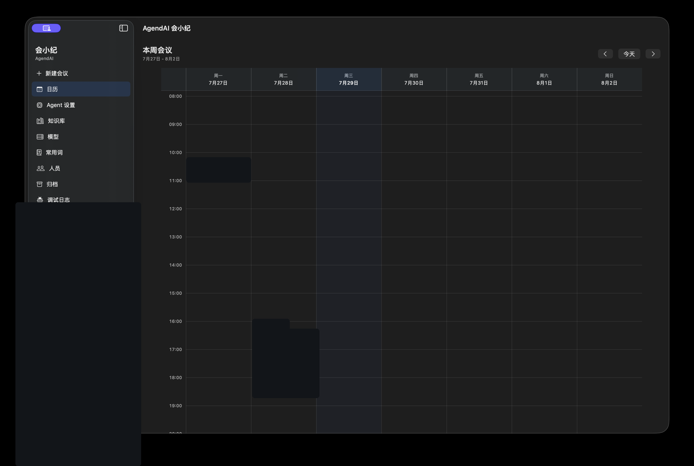
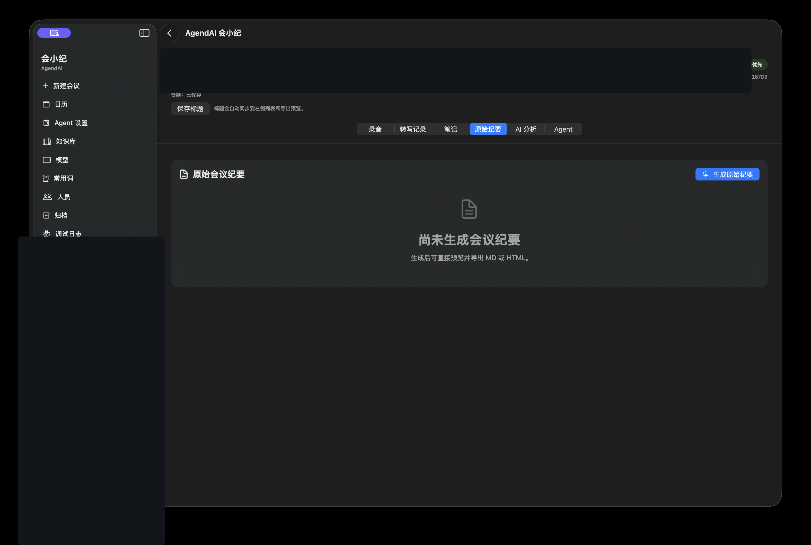

# AgendAI 会小纪

> 本地优先的原生 macOS 会议听记工具。录下麦克风和电脑音频，实时转写，会后生成可编辑、可导出的会议纪要。

[](#系统要求)
[](LICENSE)

AgendAI 会小纪面向需要沉淀会议记录并持续跟进会议行动项的个人和小团队。会议数据默认保存在本机；你可以接入自己的兼容 OpenAI API 的模型服务完成转写、纪要和分析。

## 适合什么场景

- 线下会议：录制麦克风声音，实时查看转写。
- 线上会议：采集电脑音频、麦克风或两者混合录音。
- 会后整理：保留原始转写，生成正式会议纪要和独立 AI 分析。
- 个人工作台：把会议纪要、AI 分析和 Agent 生成的待办统一为可确认、可跟进、可完成的工作项。
- 持续沉淀：管理参会人员、常用词、会议笔记、工作状态和导出文件。

## 核心功能

| 模块 | 能力 |
| --- | --- |
| 会议与工作台 | 新建、暂停、恢复、结束、归档会议；在按日期的个人工作台中查看会议和任务。 |
| 原生录音 | 支持麦克风、电脑音频、混合录音；在开始前检查权限与模型状态。 |
| 实时转写 | 按时间线保存文本；录音中使用稳定的临时发言人标记。 |
| 会后整理 | 自动生成正式会议纪要；原始转写保持独立，可重新生成和人工修改。 |
| 发言人与词库 | 管理人员、别名、声纹样本和常用词；人工修改优先于自动结果。 |
| 笔记与导出 | 支持文字和图片笔记；导出 Markdown、HTML 和原始转写。 |
| AI 分析与 Agent | 独立生成分析结论和结构化待办，不覆盖正式会议纪要；待办和未决事项可生成禅道交接草稿。 |
| 工作项闭环 | 统一管理会议行动项、AI 分析任务、Agent 待办和手动任务；支持负责人、计划日期、优先级、标签、状态和完成备注。 |
| 外部系统 | 在“设置 > 外部系统 > 禅道”配置禅道地址、账号和 API Token，支持内网或公网 HTTPS 部署。 |

## 界面预览

个人工作台按日期展示会议和工作项；实际会议标题、人员和项目内容已打码。

<p align="center">
  
</p>

会议详情通过录音、转写记录、笔记、会议纪要、AI 分析和 Agent 标签组织同一场会议；下图的会议身份信息已打码。

<p align="center">
  
</p>

## 使用流程

1. 在“设置 > 模型”中配置 ASR 和会议纪要模型，并测试连通性。
2. 新建会议，选择麦克风、电脑音频或混合录音。
3. 按系统提示授予麦克风和屏幕录制权限。
4. 开始录音，实时查看转写；需要时可暂停、恢复或修正发言人。
5. 结束会议后查看原始转写、会议纪要和 AI 分析。
6. 打开“待办任务池”，在一级列表中确认负责人和截止日期；确认后任务会进入“工作台”日历。也可以点击“新建任务”创建个人任务。
7. 在工作台任务卡或任务详情中维护计划起止日期、优先级和标签，按状态推进到完成并填写成果说明。
8. 在“设置 > 外部系统 > 禅道”配置禅道后，可在待办或未决事项上点击“任务交接到禅道”。
9. 确认内容后导出 Markdown 或 HTML。

## 禅道交接

禅道地址是应用配置项，不绑定某个固定 IP。你可以填写内网地址、局域网域名或公网 HTTPS 域名，例如 `https://zentao.example.com`。

交接按钮采用人工确认流程：会小纪根据事项生成任务草稿，复制到剪贴板并打开配置的禅道地址，由用户在禅道中确认后创建任务。当前版本不会未经确认直接调用禅道创建任务，也不需要 MCP。

建议为禅道创建专用个人 API Token，并只授予创建任务所需的最小权限。公网部署时请使用 HTTPS，并通过网络访问控制限制禅道管理接口。

## 安装

### 系统要求

- macOS 14 或更高版本。
- Xcode Command Line Tools，用于从源码构建。
- 首次录音时，需要在系统设置中授予麦克风权限；采集电脑音频时还需要屏幕录制权限。

### 从源码安装

```sh
git clone https://github.com/leoyoul/AgendAI.git
cd AgendAI
sh scripts/install_macos_app.sh
open '/Applications/AgendAI 会小纪.app'
```

安装脚本会构建正式版 `v0.1.8`、创建 DMG、挂载并校验签名，然后安装到 `/Applications`。也可以直接下载 [v0.1.8 Release](https://github.com/leoyoul/AgendAI/releases/tag/v0.1.8) 中的 `AgendAI-v0.1.8-macOS-universal.dmg`，将左侧的“会小纪”拖到右侧的“Applications”。首次打开后，请在应用内完成模型配置。

### 检查更新

应用每次启动会在后台检查更新；也可以点击顶部“会小纪”品牌区或在应用菜单中选择“检查更新…”。发现新版本后，Sparkle 会显示标准更新窗口，可完成下载、签名校验、安装和重启，不需要再次手动替换应用。

当前发布包使用本地 ad-hoc 签名，尚未使用 Apple Developer ID 或公证。首次打开或更新后，macOS 可能要求右键选择“打开”，或在“系统设置 → 隐私与安全性”中确认“仍要打开”。

## 模型配置

应用不附带模型服务或 API Key。请在“模型”页按用途分别配置：

- **ASR 模型**：用于实时和会后语音转写，需要兼容 OpenAI API 的语音转写接口。
- **会议纪要模型**：用于将转写整理为正式纪要；可按需开启视觉能力以理解图片笔记。
- **AI 分析 / Agent 模型**：用于会后分析、问答和结构化待办，和正式会议纪要相互独立。

配置完成后先执行连通性测试。模型不可用、权限缺失或采集失败时，应用会显示可读错误，不会静默丢失录音任务。

## 隐私与数据

- 会议、转写、笔记和导出内容默认保存在本机 SQLite 数据库中。
- 每次应用版本变化时，会在数据库升级前通过 SQLite 安全备份生成快照；最近 3 份保存在应用数据目录的 `Backups/Upgrades` 中。
- 使用第三方模型时，音频、转写或图片会按你的配置发送到对应服务；请自行确认服务的数据政策。
- 升级到 AgendAI 会小纪时，应用仅在本机迁移旧版本的会议数据库，旧库会保留，不会上传。
- 仓库不包含真实会议、录音、数据库、API Key、模型文件、个人 Codex 配置或 Skills。
- 录制他人声音前，请遵守所在地区的告知和同意要求。

## 常见问题

### 无法开始录音

确认已配置可用的 ASR 模型；麦克风录音需要麦克风权限，电脑音频或混合录音还需要屏幕录制权限。授权后需要按应用提示重新打开应用。

### 无法采集线上会议声音

确认目标应用正在播放音频，并已授予屏幕录制权限。部分受保护音频路径无法由 macOS 采集，此时请切换为麦克风录制或使用可用的系统音频采集方式。

### 发言人识别不准确

优先保留未知发言人并人工修正，再补录清晰、时长足够的声纹样本。人工修改不会被后续自动识别覆盖。

### 会议纪要没有生成

检查会议纪要模型是否已启用、模型名称和服务地址是否正确。即使纪要生成失败，原始转写仍可单独保留和导出。

### 工作台任务没有出现在日期格中

只有完成负责人和截止日期确认的任务才会进入工作台日期格。负责人未匹配、负责人不唯一或截止日期无法识别的任务会进入“待办任务池”，可以直接在一级列表中补充负责人和日期并确认。

## 开发与验证

开发环境还需要 Node.js 25 或更高版本，用于本地 Agent/MCP 工具测试。

```sh
swift test
(cd Tools/tinglan_agentd && npm test)
(cd Tools/tinglan_mcp && npm test)
sh scripts/check_macos.sh
```

`check_macos.sh` 会执行公开文档检查、Swift 测试、打包检查，并验证生成的 macOS 应用签名。

## 项目结构

```text
Sources/          SwiftUI 应用、录音、转写、持久化和导出逻辑
Tools/            本地 Agent 与 MCP 辅助工具源码
scripts/          构建、安装和校验脚本
tests/            Swift、Node 和 macOS 打包测试
assets/screenshots/ README 使用的无敏感真实界面截图
```

## 贡献与安全

欢迎提交 Issue 和 Pull Request。请先阅读 [CONTRIBUTING.md](CONTRIBUTING.md)。

安全问题请参阅 [SECURITY.md](SECURITY.md)。提交前不要加入真实录音、会议纪要、数据库、截图、模型权重或凭证。

## 许可证

本项目采用 [MIT License](LICENSE)。
